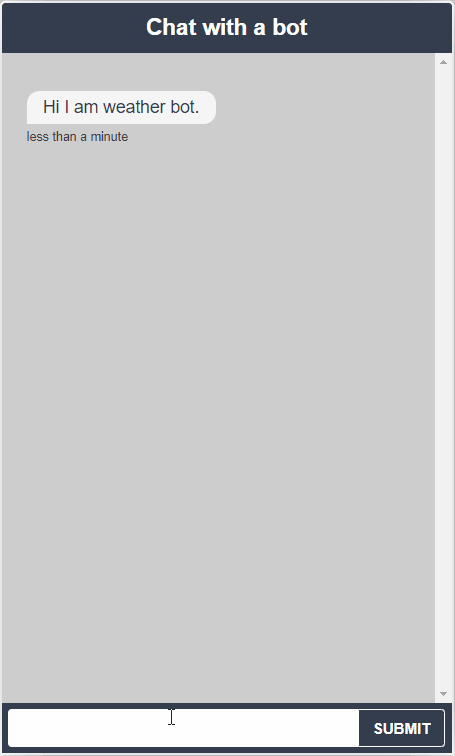

# Weather chatbot assignment

In this assignment I am tasked to create chatbot which will provide real weather report for given location.

<p align="center">
    
</p>
## Setup

Needs private weather api (https://app.tomorrow.io/home) token defined in .env file. 
```dotenv
#contents of .env file
CLIMACELL_API_KEY=token
```
Run both rasa and rasa_action_server using docker-compose
```
#get .env file with weather api token
docker-compose up -d --build
```

Now there should be running rasa API on port 5005. To test it out visit localhost:8880 where is hosted demo chatroom (using .js from https://github.com/scalableminds/chatroom)

## Assumptions

- User asks for weather using words that are similar / close to word weather (sunny, cloudy, ...)
- Location must be specified as name of City or Country

## Future plan

- Secure connections
- Spacy entity and trained DIETclassifier are weak when detecting less known cities. Needs more data or better city entity recognition.


## References
- https://medium.com/coinmonks/rasa-python-weather-chatbot-51fc218d346d
- https://towardsdatascience.com/how-to-create-a-weather-chatbot-b8ef1b1d6703
- https://chatbotslife.com/building-a-weather-chatbot-with-rasa-nlu-and-rasa-core-8a295f29c405
- https://rasa.com/docs/rasa/
- https://docs.tomorrow.io/reference/welcome
- https://github.com/Super-Serious/bot
- https://geotext.readthedocs.io/en/latest/
